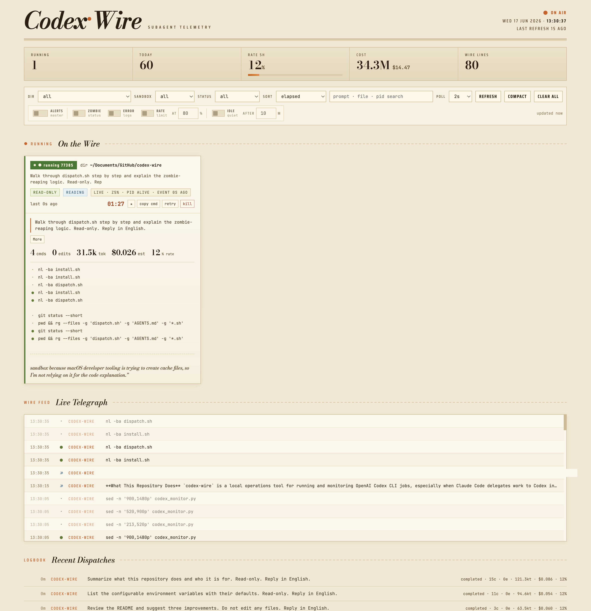

[English](README.md) · 한국어

# codex-wire

[](https://github.com/part3917/codex-wire)

codex-wire의 Windows 포트입니다. 원본 [part3917/codex-wire](https://github.com/part3917/codex-wire)를 기준으로 하며, 대시보드 기능과 UI는 macOS 원본과 동일하게 유지하고 Windows용 PowerShell 실행/디스패치 스크립트를 제공합니다. by 3917



<!-- 스크린샷 갱신 필요: assets/*.png는 현재 UI보다 오래되었을 수 있습니다. -->

## 무엇을 하나요

- `dispatch.ps1`은 Windows에서 하나의 `codex exec` 작업을 실행하고, 고유한 `--output-last-message` 파일을 통해 완료를 감지한 뒤, Codex가 끝난 후에도 남아 있을 수 있는 잔여 프로세스를 정리합니다. 원본 bash `dispatch.sh`는 macOS/Linux 참고용으로 유지합니다.
- `codex_monitor.py`는 `http://localhost:8787`에서 동작하는 Python 표준 라이브러리만으로 구성된 웹 대시보드입니다. `ps`와 `~/.codex/sessions`를 읽어 실행 중인 작업, 최근 세션, 활동, 토큰, 비용, 디스패치 상태를 보여줍니다.
- `codex-instructions`는 `CODEX_INSTRUCTIONS_FILE`을 통해 Codex가 지시 파일을 참조하도록 가리켜 주는 선택적 런처입니다.

## 대시보드

`http://localhost:8787`에서 동작하는 Python 표준 라이브러리만으로 구성된 웹 UI입니다 — 데이터베이스도, Python 패키지 의존성도 없습니다. 브라우저는 Google Fonts를 외부에서 로드합니다. 모니터는 일정 간격으로 `ps`와 Codex 세션 디렉터리를 폴링하여 위임된 모든 Codex 작업을 실시간으로 렌더링합니다. 위에서 아래로 각 섹션이 하는 일은 다음과 같습니다.

### 매스헤드 & 통계


매스헤드는 대시보드 정체성, 현재 날짜/시간, 새로고침 신선도를 보여줍니다. 방송 표시등은 적어도 하나의 작업이 실행 중일 때 **`ON AIR`**, 실행 중인 것이 없을 때 **`STANDBY`**로 표시됩니다.

그 아래에는 한눈에 보는 통계 4개와 별도의 Codex 비용 패널이 있습니다:

| 통계 | 의미 |
|------|---------|
| **Live** | `ps`에서 감지한 현재 실행 중인 `codex exec` 작업 수. |
| **Sessions today** | 오늘 시작된 Codex 세션 수 (`~/.codex/sessions/YYYY/MM/DD/`, 또는 설정된 세션 루트 아래의 JSONL 파일). |
| **Rate** | 관측된 가장 높은 rate-limit 사용량을 백분율 + 게이지로 표시합니다. 인라인 토글로 **5h**(`primary`, 5시간 창)와 **7d**(`secondary`, 주간 창)를 전환합니다. 선택한 창은 `localStorage`에 기억됩니다. |
| **Wire feed** | 최근 피드 창에서 활성 상태였던 세션을 기준으로, 현재 라이브 피드에 있는 이벤트 행의 수. |

### Codex 비용 패널

비용 패널은 상단 통계와 분리되어 있습니다. `token_count` 이벤트와 모니터에 고정된 가격표를 사용해 Codex 비용을 추정합니다: `gpt-5.5` 기준 **입력 토큰 $5.00 / 1M**, **캐시 입력 토큰 $0.50 / 1M**, **출력 토큰 $30.00 / 1M**입니다. 세션의 모델이 비어 있거나 알 수 없는 값이면 모니터는 `gpt-5.5` 가격으로 fallback합니다.

패널 구성은 다음과 같습니다:

| 컨트롤 / 보기 | 의미 |
|----------------|---------|
| **5H / Day / Wk / Mo / Yr** | 최근 5시간, 24시간, 7일, 30일, 12개월 비용 창을 전환하는 타임프레임 탭입니다. 선택한 타임프레임은 `localStorage`에 기억됩니다. |
| **각진 area 그래프** | 선택한 타임프레임의 버킷별 비용을 smoothing 없이 표시하는 area 차트입니다. |
| **가로 그리드** | 현재 피크 버킷 기준으로 동적으로 계산되는 "nice" 금액 그리드라인입니다. |
| **시간축** | 선택한 창에 맞춘 세로 가이드와 시간 라벨입니다. 가능한 경우 `now`도 표시합니다. |
| **hover 상세** | 마우스 hover 시 세로 가이드선, 점 마커, 버킷 시각과 금액이 있는 툴팁을 표시합니다. |
| **`est` / `est:fallback`** | `est`는 토큰 사용량에서 계산한 추정값이라는 뜻입니다. `est:fallback`은 세션 모델을 알 수 없거나 지원하지 않아 fallback `gpt-5.5` 가격을 사용했다는 뜻입니다. |

### 컨트롤 & 알림


뷰를 필터링, 정렬, 조정합니다. 필터, 정렬, 폴링은 아래의 실행 중인 작업 카드에 적용됩니다.

| 컨트롤 | 하는 일 |
|---------|--------------|
| **DIR** | 작업 디렉터리로 카드를 필터링. |
| **SANDBOX** | 샌드박스 모드(`read-only` / `workspace-write`)로 필터링. |
| **STATUS** | 상태로 필터링: running, zombie, error, done, killed, interrupted. |
| **SORT** | 경과 시간, 편집 수, 토큰, 마지막 활동으로 카드 정렬 (고정된 카드는 항상 맨 앞에 유지). |
| **search** | pid, cwd, sandbox, status, stage, prompt, commands, activity, errors, 파일 이름 전반에 걸친 텍스트 매칭. |
| **POLL** | 자동 새로고침 간격: 1s / 2s / 5s / 10s. |
| **REFRESH** | 즉시 새로운 스냅샷을 가져옴. |
| **COMPACT** | 카드 본문을 압축된 행으로 접음. |
| **CLEAR ALL** | 필터, 고정, 압축 상태, 알림, 폴링을 기본값으로 초기화. |

알림 토글은 데스크톱 알림을 발생시킵니다:

| 토글 | 발생 조건… |
|--------|-------------|
| **ALERTS** (마스터) | 마스터 스위치 — 꺼져 있으면 아래의 토글들은 무시됩니다. |
| **ZOMBIE** | 실행 중인 작업이 새로 `zombie` 상태에 진입할 때. |
| **ERROR** | 실행 중인 작업이 새로운 오류 로그 출력을 기록할 때. |
| **RATE** (`AT __%`) | 관측된 최대 rate 사용량이 설정한 백분율 임계치를 넘을 때. |
| **IDLE** (`AFTER __ M`) | 여전히 실행 중인 작업이 지정한 분 동안 조용할 때. |

### On the Wire — 실행 중인 작업


지금 이 순간 실행 중인 Codex 작업의 라이브 그리드입니다. 각 카드는 상태 알약(pill) + pid, 작업 디렉터리, 프롬프트, 샌드박스 배지, 단계(stage), 활동 신호, 마지막 이벤트 경과 시간, 그리고 진행 중인 경과 타이머를 보여줍니다 — 여기에 더해 `cmds`, `edits`, `tok`, 예상 비용, rate 백분율에 대한 텔레메트리도 함께 표시됩니다. 본문은 최근 command / edit / message / error / output 이벤트와 마지막 에이전트 메시지를 스트리밍하며, 상세 내용을 펼칠 수 있습니다. 카드 액션: **pin**, **copy cmd**(마지막 또는 대기 중인 명령), **retry**(cwd + prompt를 새로운 `codex exec`로 다시 실행), **kill**.

빈 상태: *Idle — no Codex jobs match the filter.*

### Live Telegraph


모든 작업에 걸친 세션 이벤트의 스크롤되는 실시간 피드입니다 — 명령, 편집, 메시지, 오류, 출력이 들어오는 대로 표시됩니다. 빈 상태: *Quiet wire.*

### Recent Dispatches

같은 뷰의 맨 아래에 있는 로그북입니다(위 그림에 표시됨): 최근에 끝난, 실행 중이 아닌 세션을 상태, 경과 시간, 소스 디렉터리, 프롬프트, command / edit 개수, 토큰, 예상 비용, rate 백분율과 함께 보여줍니다. 빈 상태: *No history.*

## Windows 사용법

이 저장소는 [part3917/codex-wire](https://github.com/part3917/codex-wire)의 Windows 포트입니다. 기능과 UI는 macOS 원본과 동일하며, Windows에서는 PowerShell 기반 설치, 실행, 디스패치 진입점을 사용합니다.

### Windows 요구사항

- Windows 10 또는 Windows 11.
- PowerShell에서 `python`으로 실행 가능한 Python 3.x.
- 설치되어 있고 `codex` 명령으로 실행 가능한 OpenAI Codex CLI.
- `codex login` 완료.
- PowerShell.

### Windows 설치

이 clone의 PowerShell에서 실행합니다:

```powershell
.\install.ps1
```

`install.ps1`은 필요한 경우 `.env.example`에서 `.env`를 만들고, Windows 디스패치 래퍼를 `~\.codex\dispatch.ps1`에 설치합니다.

### Windows 실행

모니터를 시작합니다:

```powershell
.\run.ps1
```

또는 Python 모니터를 직접 실행할 수 있습니다:

```powershell
python .\codex_monitor.py
```

그런 다음 `http://localhost:8787`을 엽니다.

### Windows 디스패치

Windows에서 위임된 Codex 작업은 `dispatch.ps1`을 사용합니다:

```powershell
.\dispatch.ps1 <read-only|workspace-write> <cwd> "<prompt>" [max_minutes]
```

예시:

```powershell
.\dispatch.ps1 workspace-write (Get-Location).Path "Run the tests and fix any failures" 30
```

bash용 `dispatch.sh`는 macOS/Linux 원본 동작 참고용으로 남겨 둡니다. Windows에서는 `dispatch.ps1`을 사용하세요.

## macOS / Bash 참고용 사전 준비물

- [Claude Code](https://claude.com/claude-code) — Codex에 작업을 위임하도록 의도된 드라이버 (`dispatch.sh`는 단독으로도 실행할 수 있습니다).
- OpenAI Codex CLI 설치.
- `codex login` 완료.
- Python 3.7+ (`ThreadingHTTPServer`와 `subprocess.run(..., text=True)`를 사용합니다).

## macOS / Bash 참고용 설치

```bash
git clone https://github.com/part3917/codex-wire.git codex-wire
cd codex-wire
./install.sh
```

`install.sh`가 하는 일:

- 이 clone의 `dispatch.sh`를 `~/.codex/dispatch.sh`에 설치합니다(현재 동작은 심볼릭 링크).
- `.env`가 없을 때만 `.env.example`에서 `.env`를 생성합니다. 기존 `.env`는 덮어쓰지 않습니다.
- `examples/codex.md`의 `/codex` Claude Code 커맨드를 `~/.claude/commands/codex.md`에 설치합니다. 기존 파일이 있으면 덮어쓰지 않습니다.

수동 설정:

```bash
mkdir -p ~/.codex
ln -sf "$PWD/dispatch.sh" ~/.codex/dispatch.sh
cp .env.example .env
```

로컬 경로와 기본값에 맞게 `.env`를 편집하세요.

## macOS / Bash 참고용 사용법

위임된 Codex 작업 하나를 실행:

```bash
./dispatch.sh <read-only|workspace-write> <cwd> "<prompt>" [max_minutes]
```

예시:

```bash
./dispatch.sh workspace-write "$PWD" "Run the tests and fix any failures" 30
```

모니터 실행:

```bash
python3 <clone-dir>/codex_monitor.py
```

그런 다음 `http://localhost:8787`을 엽니다.

선택적 지시 런처:

```bash
CODEX_INSTRUCTIONS_FILE=/path/to/your/AGENTS.md ./codex-instructions exec -C "$PWD" "Summarize this repo"
```

`CODEX_INSTRUCTIONS_FILE`이 설정되지 않았거나 비어 있으면, `codex-instructions`는 지시를 추가하지 않고 `codex`를 실행합니다.

## Claude Code 연동

`dispatch.sh`는 Claude Code가 다른 작업을 계속 모니터링하거나 조율하는 동안, 코딩 작업을 Codex에 위임하기 위해 백그라운드에서 호출되도록 의도되었습니다.

바로 쓸 수 있는 **`/codex` 스킬** — 오케스트레이션 doctrine(Claude가 기획, Codex가 코딩, 그리고 이 대시보드로 **중간 점검**) — 이 [`examples/codex.md`](examples/codex.md)에 있습니다. `~/.claude/commands/codex.md`로 복사하면 `/codex` 슬래시 커맨드로 쓸 수 있습니다. 핵심: 던지고 기다리는 건 위임이고, 도는 작업을 지켜보며 중간에 조정하는 게 오케스트레이션입니다.

## 설정

`.env.example`을 `.env`로 복사한 뒤 필요에 따라 값을 편집하세요. 주요 노브는 다음과 같습니다:

- `CODEX_INSTRUCTIONS_FILE`: `codex-instructions`를 위한 선택적 지시 파일.
- `CODEX_WIRE_OUTDIR`: 디스패치 요약과 로그의 출력 디렉터리.
- `CODEX_MONITOR_SESS_DIR`: Codex 세션 JSONL 루트 override. 기본값: `~/.codex/sessions`.
- `CODEX_MONITOR_*`: 대시보드 스캔 한도, stale 임계치, 바인드 호스트/포트, 추적 파일, 재시도 명령, 세션 루트.

비용 추정은 `codex_monitor.py`에 내장된 고정 가격표를 사용합니다. 토큰 가격은 `.env`로 설정하지 않습니다.

## 출처 표기

모니터 UI와 프로젝트 자료에 `by 3917` 크레딧을 유지해 주세요.
